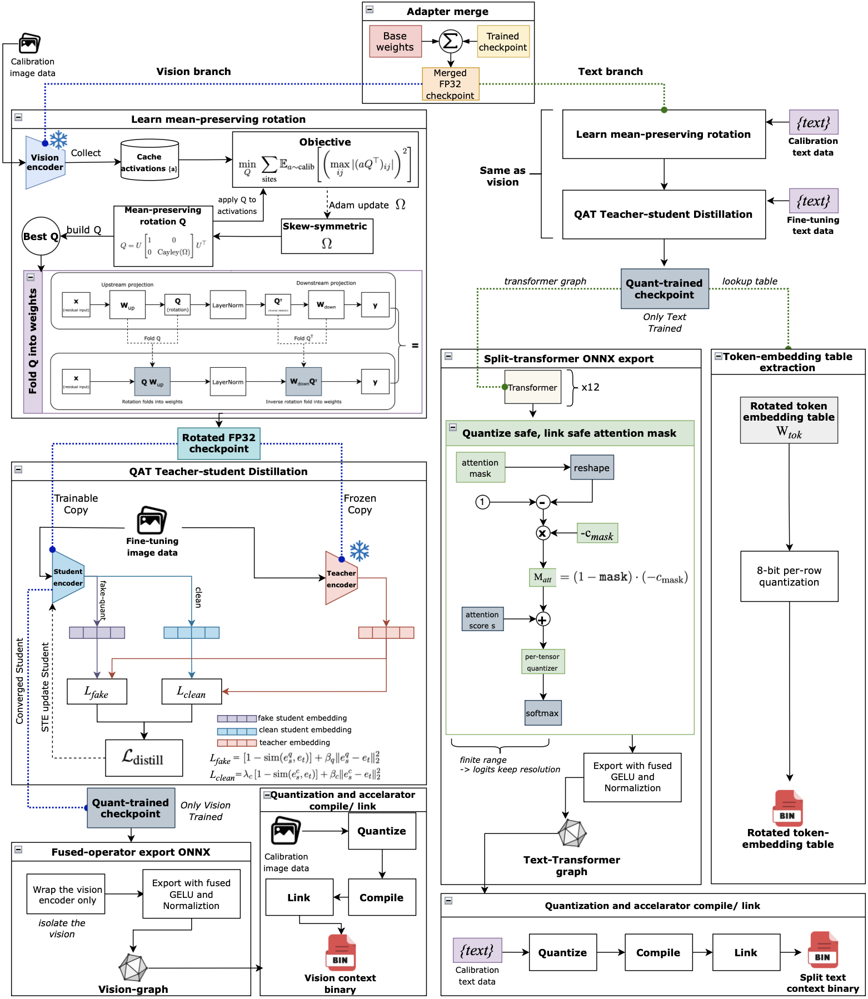

<div align="center">

# mSigLIP for Multilingual Text-Based Person Search

**Hard-negative-aware training for Vietnamese, English, and Chinese TBPS, with an INT8 deployment path for Qualcomm RB3 Gen2.**

*Model training method is accepted at ICIP 2026 Tampere Finland*

<p>
  
  
  
  
  
</p>

<p>
  <a href="#results">Results</a> •
  <a href="#method">Method</a> •
  <a href="#quick-start">Quick Start</a> •
  <a href="#deployment">Deployment</a> •
  <a href="#project-map">Project Map</a>
</p>

</div>

---

## Snapshot

<table>
  <tr>
    <td width="33%" align="center">
      <strong>VN3K / Vietnamese</strong><br>
      <span style="font-size:24px"><strong>52.28</strong></span><br>
      T2I Rank@1, paper headline
    </td>
    <td width="33%" align="center">
      <strong>PRW-TPS-CN / Chinese</strong><br>
      <span style="font-size:24px"><strong>59.35</strong></span><br>
      T2I Rank@1, multilingual generalization
    </td>
    <td width="33%" align="center">
      <strong>RB3 Gen2 / HTP v68</strong><br>
      <span style="font-size:24px"><strong>50.35</strong></span><br>
      Board both-INT8 W8A8 T2I Rank@1
    </td>
  </tr>
</table>

| Track | Status | Current next step |
|---|---|---|
| **Training** | LoRA + Curriculum Circle Loss is the main reported method. It trains **5.9M parameters, about 1.57% of the 376M-parameter base model**. | Keep the paper recipe as the clean deployment baseline. |
| **Multilingual evaluation** | VN3K, 10% CUHK-PEDES, and PRW-TPS-CN results are reported below. | Extend full multilingual ablations only when needed. |
| **Edge deployment** | Both encoders now pass directly on RB3: board both-INT8 reaches **50.35** T2I R@1 and **54.20** I2T R@1, a `-1.93` T2I drop from the paper baseline `52.28`. Vision v9 is board-verified at **50.35** T2I R@1. | Use this as the final thesis deployment result. |

## What This Repository Contains

This repository implements the training and deployment stack for paper **A Hard Negative-Aware Optimization for Multilingual Text-Based Person Search**.

The core idea is deliberately simple:

```text
mSigLIP multilingual dual encoder
  + LoRA adapters
  + N-ITC/MVS, C-ITC, SimCLR
  + curriculum-weighted Cross-modal Circle Loss
  -> multilingual person retrieval embeddings
```

The method keeps the large multilingual mSigLIP backbone mostly frozen and trains a compact LoRA subspace. Circle Loss is introduced through a curriculum so the model first learns stable global image-text alignment, then focuses on hard negatives.

## Results

### Main Results

| Dataset | Language | Main result | Notes |
|---|---|---:|---|
| VN3K / 3000VnPersonSearch | Vietnamese | **52.28 T2I R@1** | Paper headline, seed `2400` |
| 10% CUHK-PEDES | English | **57.10 T2I R@1** | Low-data English setting |
| PRW-TPS-CN | Chinese | **59.35 T2I R@1** | Multilingual generalization |

### VN3K / 3000VnPersonSearch

| Method | R@1 | R@5 | R@10 | mAP | mINP |
|---|---:|---:|---:|---:|---:|
| TBPS-mSigLIP (Full FT) | 49.70 | 75.93 | 84.75 | 54.96 | 48.66 |
| Ours (LoRA only) | 49.90 | 78.05 | 86.30 | 55.83 | 49.45 |
| Ours (LoRA + Circle fixed) | 50.53 | 77.78 | 86.43 | 55.94 | 49.37 |
| **Ours (LoRA + Curriculum Circle)** | **52.28** | **79.55** | **88.03** | **57.32** | **50.57** |

Best result uses seed `2400`. Mean over 3 seeds: `R@1 = 51.52 +/- 0.68`.

### 10% CUHK-PEDES

| Method | R@1 | R@5 | R@10 | mAP | mINP |
|---|---:|---:|---:|---:|---:|
| TBPS-mSigLIP (Baseline) | 46.73 | 68.65 | 77.55 | 41.75 | 26.56 |
| Ours (LoRA + Circle fixed) | 56.87 | **77.18** | 84.15 | 50.70 | 34.61 |
| **Ours (LoRA + Curriculum Circle)** | **57.10** | 76.98 | **84.34** | **50.90** | **34.85** |

### PRW-TPS-CN

| Method | R@1 | R@5 | R@10 | mAP | mINP |
|---|---:|---:|---:|---:|---:|
| TPAN | 21.63 | 42.54 | 52.99 | - | - |
| TBPS-mSigLIP (Baseline) | 46.78 | 60.28 | 66.82 | 35.41 | 10.61 |
| **Ours (mSigLIP-CLoRA)** | **59.35** | **70.58** | **75.48** | **46.44** | **15.10** |

### Qualitative Retrieval


The model improves retrieval in cases where visually similar distractors differ only by fine-grained clothing, shoe, or logo attributes.

## Method


### Loss Stack

The default training objective is:

$$\mathcal{L} = \mathcal{L}_{N\text{-}ITC/MVS} + 0.1\,\mathcal{L}_{C\text{-}ITC} + 0.4\,\mathcal{L}_{SS} + \alpha_5(t)\,\mathcal{L}_{circle}$$

Circle Loss is the hard-negative component:

| Setting | Value |
|---|---:|
| Margin `m` | `0.25` |
| Scale `gamma` | `128` |
| Epochs 0-5 | Circle off |
| Epochs 6-20 | Linear ramp to `0.1` |
| Epochs 21-60 | Stable at `0.1` |

### Mathematical Formulation

The baseline optimizes a multi-task objective over $L_2$-normalized image embeddings $\mathbf{v}_i$ and text embeddings $\mathbf{u}_i$:

$$\mathcal{L}_{\text{base}} = \alpha_1 \mathcal{L}_{N\text{-}ITC} + \alpha_2 \mathcal{L}_{MVS} + \alpha_3 \mathcal{L}_{C\text{-}ITC} + \alpha_4 \mathcal{L}_{SS}$$

N-ITC is the sigmoid-based pairwise alignment loss:

$$\mathcal{L}_{N\text{-}ITC} = -\frac{1}{N}\sum_{i=1}^{N}\sum_{j=1}^{N} \log\sigma\left(z_{ij}\left(\gamma\,\mathbf{v}_i^\top\mathbf{u}_j - c\right)\right)$$

where $z_{ij} \in \{+1, -1\}$ indicates matched and unmatched image-text pairs.

C-ITC enforces structured alignment through in-modality consistency and cross-modality symmetry:

$$\mathcal{L}_{C^I\text{-}ITC} = \frac{1}{N^2}\sum_{i,j}\left(\mathrm{sim}(\mathbf{v}_i,\mathbf{v}_j)-\mathrm{sim}(\mathbf{u}_i,\mathbf{u}_j)\right)^2$$

$$\mathcal{L}_{C^C\text{-}ITC} = \frac{1}{N^2}\sum_{i,j}\left(\mathrm{sim}(\mathbf{v}_i,\mathbf{u}_j)-\mathrm{sim}(\mathbf{v}_j,\mathbf{u}_i)\right)^2$$

$$\mathcal{L}_{C\text{-}ITC} = \lambda_I \mathcal{L}_{C^I\text{-}ITC} + \lambda_C \mathcal{L}_{C^C\text{-}ITC},\qquad \lambda_I=\lambda_C=0.25$$

MVS enforces consistency between original images and augmented views using the N-ITC formulation.

SS is a SimCLR-style self-supervision loss over two augmented views of the same image:

$$\mathcal{L}_{SS} = -\frac{1}{2N}\sum_{i=1}^{2N}\log\frac{\exp\left(\mathrm{sim}(\mathbf{v}_i,\mathbf{v}_{i^+})/\tau_s\right)}{\sum_{k\neq i}\exp\left(\mathrm{sim}(\mathbf{v}_i,\mathbf{v}_k)/\tau_s\right)}$$

The auxiliary Cross-modal Circle Loss mines hard positives and hard negatives:

$$\mathcal{L}_{circle} = \log\left[1 + \sum_{j \in \mathcal{N}} e^{\gamma\,\alpha_n^j(s_n^j - m)} \cdot \sum_{i \in \mathcal{P}} e^{-\gamma\,\alpha_p^i(s_p^i - (1-m))}\right]$$

with adaptive weights:

$$\alpha_p^i = [1 + m - s_p^i]_+,\qquad \alpha_n^j = [s_n^j + m]_+$$

The final objective is:

$$\mathcal{L} = \mathcal{L}_{\text{base}} + \alpha_5(t)\,\mathcal{L}_{circle}$$

The curriculum schedule for $\alpha_5(t)$ is:

$$\alpha_5(t) = \begin{cases} 0, & t \leq 5 \\ 0.1 \times \frac{t - 5}{15}, & 5 < t \leq 20 \\ 0.1, & t > 20 \end{cases}$$

### Analysis Figures

| Gradient behavior | Embedding geometry |
|---|---|
|  |  |

## Quick Start

### Install

```bash
git clone https://github.com/pahmlam/Research_on_CircleLoss_for_TBPS-mSigLIP.git
cd Research_on_CircleLoss_for_TBPS-mSigLIP
curl -LsSf https://astral.sh/uv/install.sh | sh
uv sync
```

The project targets Python `>=3.11`. `uv sync` is the recommended dependency workflow.

### Prepare Data and Checkpoints

Expected datasets:

| Dataset | Language | Role |
|---|---|---|
| VN3K / 3000VnPersonSearch | Vietnamese | Main low-resource benchmark |
| CUHK-PEDES | English | English retrieval benchmark |
| PRW-TPS-CN | Chinese | Multilingual generalization benchmark |

Prepare local mSigLIP checkpoint assets:

```bash
uv run scripts/prepare_checkpoints.py
```

### Train

Paper recipe:

```bash
bash run_cir_loss.sh
```

Full fine-tuning baseline:

```bash
bash run_full_finetune.sh
```

Hydra baseline entrypoint:

```bash
uv run trainer.py -cn m_siglip img_size_str="'(256,256)'" \
  dataset=vn3k loss.softlabel_ratio=0.0 trainer.max_epochs=60
```

### Evaluate

`test.py` wraps `src/msiglip/evaluate.py` through Fire:

```bash
uv run test.py --ckpt_path artifacts/models/checkpoints/epoch=56-val_score=52.28.ckpt \
  --dataset_name vn3k
```

## Deployment

The deployment branch targets **Qualcomm RB3 Gen2 / QCS6490 / HTP v68** with QNN context binaries. The current deploy path is all-INT8 W8A8 for both the vision and text encoders.



### Target Hardware Specification

| Component | Specification |
|---|---|
| **Platform** | Qualcomm Robotics RB3 Gen2 |
| **SoC** | Qualcomm QCS6490 |
| **CPU** | Kryo 670 (4x Cortex-A78 @ 2.7GHz, 4x Cortex-A55 @ 1.9GHz) |
| **NPU / DSP** | Qualcomm AI Engine (Hexagon 770 / HTP v68) |
| **RAM** | 5.2 GB Total (~4.0 GB Available) |
| **OS** | Ubuntu 24.04 LTS (aarch64) |

| Deployment item | Current state |
|---|---|
| Source checkpoint | `artifacts/models/checkpoints/epoch=56-val_score=52.28.ckpt` |
| Paper baseline | VN3K T2I R@1 `52.28`; local FP32 sanity reproduction is `52.40` |
| Final end-to-end board deploy | Board both-INT8 W8A8 on the full VN3K test set; T2I R@1 `50.35` (`-1.93` vs `52.28`) and I2T R@1 `54.20` |
| Off-board both-INT8 proxy | Final refined vision encoder + split-text W8A8 QDQ; T2I R@1 `50.63`, I2T R@1 `53.90` |
| Vision-only QDQ proxy | Final refined learned-rotation vision encoder; T2I R@1 `50.98`, I2T R@1 `54.20` |
| Vision-only board retrieval | QAT v9 W8A8 context binary on RB3, `50.35` T2I R@1, `54.55` I2T R@1 |
| Text-only board retrieval | Split-text W8A8 context binary on RB3, `51.30` T2I R@1, `54.80` I2T R@1 |
| Board-verified binary | Vision v9 + split-text W8A8 context binaries; direct board both-INT8 reaches `50.35` T2I R@1 |
| Board runtime | vision v9 `32.54 ms/image`, `24.29 FPS`; split-text transformer `7.87 ms/query`, `74.75 IPS` |
| Context size | vision v9 context `94.31 MB`; split-text context `87.03 MB` |
| Text CPU embedding table | token table `192.00 MB` + per-row scales `1.00 MB` |
| Text encoder | Split-encoder deploy path: RB3 CPU embedding lookup + HTP transformer/head; text branch artifacts total about `280.03 MB` |
| Canonical evidence archive | [`artifacts/deployment/logs`](artifacts/deployment/logs/README.md) stores renamed AI Hub logs, board/QDQ result JSON summaries, diagnostics, and provenance manifest |

### Board Peak RAM Probe

Peak RAM was measured on RB3 Gen2 with `deployment/scripts/qnn/measure_board_peak_ram.sh`
at `INTERVAL=0.02`. `System peak delta` is the more useful board-memory
indicator than process RSS/HWM because QNN HTP execution can allocate memory
outside the host process RSS.

| Branch / step | Input scope | Process peak HWM | System peak delta |
|---|---|---:|---:|
| Vision v9 HTP context | 1 image | `102.00 MB` | `244.91 MB` |
| Text CPU token-embedding lookup | 4000 queries | `58.26 MB` | `125.66 MB` |
| Split-text HTP context | 1 query | `95.25 MB` | `325.16 MB` |

All three probes are valid and remain within RB3 headroom; the split-text HTP
context has the largest system-level peak. See
[comprehensive deployment results](deployment/docs/comprehensive_results.md#23-peak-ram-probe)
for the full measurement table.

*NOTE: To obtain the VN3K dataset, please contact lan.lethi1@hust.edu.vn*
Final end-to-end deploy retrieval, measured directly on RB3 with board vision embeddings and board split-text embeddings:

| Direction | R@1 | R@5 | R@10 | mAP | mINP |
|---|---:|---:|---:|---:|---:|
| **T2I** | **50.35** | **77.82** | **86.50** | **55.80** | **49.28** |
| **I2T** | **54.20** | **80.50** | **89.20** | **50.26** | **33.83** |

Board-verified vision-only retrieval on RB3 (v9):

| Direction | R@1 | R@5 | R@10 | mAP | mINP |
|---|---:|---:|---:|---:|---:|
| **T2I** | **50.35** | **77.55** | **86.55** | **55.73** | **49.21** |
| **I2T** | **54.55** | **82.10** | **89.35** | **50.58** | **33.66** |

Board-verified text-only retrieval on RB3 (split-text):

| Direction | R@1 | R@5 | R@10 | mAP | mINP |
|---|---:|---:|---:|---:|---:|
| **T2I** | **51.30** | **79.43** | **87.90** | **56.97** | **50.46** |
| **I2T** | **54.80** | **81.00** | **88.60** | **51.14** | **34.72** |

Canonical references:

- [Comprehensive deployment results](deployment/docs/comprehensive_results.md)
- [Rotated W8A8 + QAT method](deployment/docs/w8a8_qat_rotated.md)
- [Deploy master journal](deployment/docs/journal/[deploy-master].md)
- [Canonical deployment evidence archive](artifacts/deployment/logs/README.md)

### Deployment Gates

| Gate | Threshold | Meaning |
|---|---:|---|
| LoRA merge | no `lora` / `adapter` / `base_layer` keys | Export must be a dense deployable model |
| Rotation invariance | cosine min `>= 0.9999` | Rotation must preserve FP32 behavior |
| Static ONNX vs PyTorch | cosine mean `>= 0.999` | Export/preprocess control |
| ONNX op sanity | `Pow=0`, fused `Gelu`, fused `LayerNormalization` | Avoid exposed GELU/RMSNorm internals |
| QDQ ONNX vs PyTorch | mean `>= 0.95`, min `>= 0.90` | Candidate worth compile/link |
| QNN board vs PyTorch | mean `>= 0.90` | Runtime on board is faithful enough |
| Full retrieval (deploy target) | T2I R@1 `>= 50.0` | Deploy target vs FP32 baseline; any result `< 50` is a FAIL |

### Model Footprint

| Component | Params | FP32 | FP16 | INT8 |
|---|---:|---:|---:|---:|
| vision_model | 92.9M | 372 MB | 186 MB | 93 MB |
| text_model | 277.7M | 1111 MB | 555 MB | 278 MB |
| projection + other | 1.2M | 5 MB | 2 MB | 1 MB |
| **Total** | **371.8M** | **1487 MB** | **744 MB** | **372 MB** |

Text is 75% of parameters because the multilingual token embedding has `250000 x 768` entries. This is why text INT8 is required for the final 4 GB RB3 deployment path.

> **Deployment commands and raw run records** are kept in the deploy master journal.
> The README reports only the current deploy state: LoRA merge → learned rotation
> → QAT distillation → opset-20 ONNX export → AI Hub W8A8 quantize/compile/link
> → on-board `qnn-net-run` → direct **INT8×INT8 retrieval on the board**.
>
> For the mathematics and method behind the deployment path, see
> **[deployment/docs/w8a8_qat_rotated.md](deployment/docs/w8a8_qat_rotated.md)**.

## Project Map

```text
src/msiglip/                       # Training, data, model, solver, utilities
  lightning_models.py              # LitTBPS Lightning module
  lightning_data.py                # TBPSDataModule
  model/                           # mSigLIP, LoRA, TBPS, losses, evidence bank
  data/                            # VN3K, CUHK-PEDES, PRW-TPS-CN datasets
  solver/                          # Optimizer and scheduler

configs/                           # Hydra configs for model, loss, datasets, LoRA
trainer.py                         # Hydra training entrypoint wrapper
test.py                            # Fire evaluation wrapper
notebooks/workspace.ipynb          # Local research/loss playground
run_*.sh                           # Reproducible training recipes

deployment/                        # RB3/QNN deployment and compression
  scripts/                         # Export, ONNX, QNN, QAT, diagnostics
  config/qnn/                      # HTP/QNN runtime config JSON files
  docs/                            # Deployment docs and runbooks
  hardware_profiling/              # RB3 profiling helpers

artifacts/                         # Generated outputs (ignored)
docs/                              # Architecture, experiment summaries, journals
knowledge/                         # Research notes and paper drafts
reports/                           # Design notes and architecture decisions
changelog/                         # Training/deployment changelogs
figures/                           # README and paper figures
```

## Documentation

| Document | Purpose |
|---|---|
| [docs/ARCHITECTURE.md](docs/ARCHITECTURE.md) | Full training/model architecture reference |
| [docs/EXPERIMENT_SUMMARY.md](docs/EXPERIMENT_SUMMARY.md) | Canonical older experiment summary |
| [docs/noise-robust-multilingual-framework.md](docs/noise-robust-multilingual-framework.md) | MNEB-HN research and implementation design |
| [docs/journal/](docs/journal/) | Dated training/model-optimization journals |
| [deployment/docs/comprehensive_results.md](deployment/docs/comprehensive_results.md) | Detailed deployment results, board isolation, QDQ proxies, and final metrics |
| [deployment/docs/w8a8_qat_rotated.md](deployment/docs/w8a8_qat_rotated.md) | Canonical W8A8 rotation/QAT deployment method |
| [deployment/docs/journal/[deploy-master].md](deployment/docs/journal/[deploy-master].md) | Consolidated deployment/model-compression journal |

## License
Distributed under the Apache License, Version 2.0. See `LICENSE.txt` for more information.

## Contact

For questions and checkpoint access please open an issue or contact the authors:

Phạm Tùng Lâm - 18phamtunglam@gmail.com
